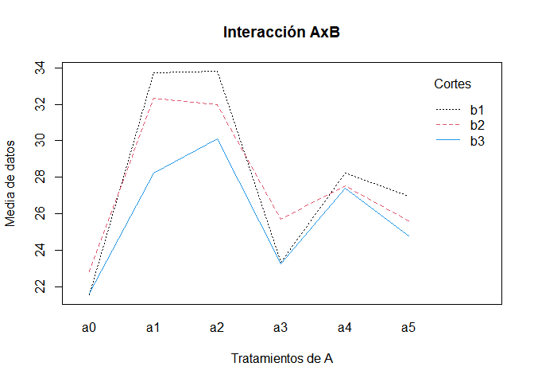
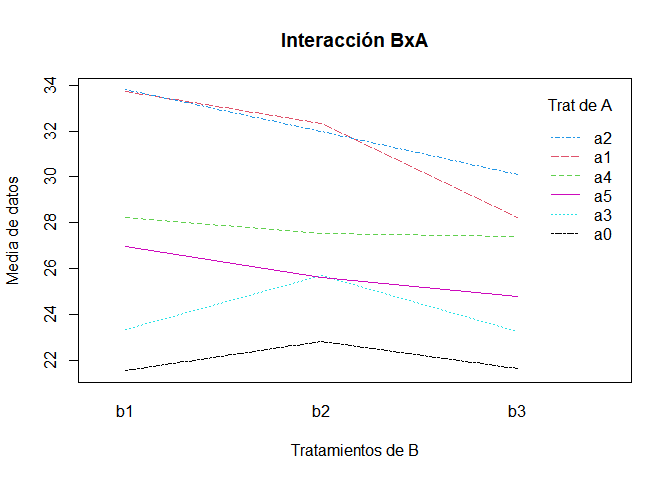

<<<<<<< HEAD
Parcelas en el tiempo
================

Son la compilación de algunos scripts para la clase de bioestadística II del programa de ingeniería forestal de la Universidad Nacional en 2015. Son ejercicios de analisis de factores y bloques. Se desarrollan anovas y pruebas post-hoc. Un ejemplo son las parcelas divididas en el tiempo. 


## Parcelas divididas en el tiempo

Diseño de 5 tratamientos A, 3 Bloques y 3 Cortes B

### b1 Primer corte

``` r
require(graphics)
y1=c(23.8,20.5,20.3,28.5,34.3,38.4,28,41.2,32.2,
    18.5,30.6,20.9,28.5,38,18.2,18.8,35.1,27)
bloques<-factor(rep(c("I","II","III"),6))
A<-factor(rep(c("a0","a1","a2","a3","a4","a5"), c(3,3,3,3,3,3)))
tabla1<-tapply(y1,list(A,bloques),sum)
tabla1
```

    ##       I   II  III
    ## a0 23.8 20.5 20.3
    ## a1 28.5 34.3 38.4
    ## a2 28.0 41.2 32.2
    ## a3 18.5 30.6 20.9
    ## a4 28.5 38.0 18.2
    ## a5 18.8 35.1 27.0

``` r
data1<-data.frame(tabla1)
m1.lm<-lm(y1~A+bloques)
m1.anova<-anova(m1.lm)
m1.anova
```

    ## Analysis of Variance Table
    ## 
    ## Response: y1
    ##           Df Sum Sq Mean Sq F value  Pr(>F)  
    ## A          5 393.61  78.721  2.6984 0.08525 .
    ## bloques    2 267.50 133.752  4.5848 0.03863 *
    ## Residuals 10 291.73  29.173                  
    ## ---
    ## Signif. codes:  0 '***' 0.001 '**' 0.01 '*' 0.05 '.' 0.1 ' ' 1

### b2 Segundo corte

``` r
y2=c(26.8,15.6,26,31.7,33.3,32,31,38,27,26.5,28,
     22.6,30,32,20.6,21.6,29.8,25.4)
tabla2<-tapply(y2,list(A,bloques),sum)
data2<-data.frame(tabla2)
m2.lm<-lm(y2~A+bloques)
m2.anova<-anova(m2.lm)
m2.anova
```

    ## Analysis of Variance Table
    ## 
    ## Response: y2
    ##           Df  Sum Sq Mean Sq F value Pr(>F)
    ## A          5 217.189  43.438  1.9770 0.1680
    ## bloques    2  45.134  22.567  1.0271 0.3929
    ## Residuals 10 219.719  21.972

### b3 tercer corte

``` r
y3=c(24.3,19.8,20.8,27.7,28.4,28.6,28.4,32.9,29,22.4,
     24.5,22.8,35.4,29.2,17.6,17.6,31,25.8)
tabla3<-tapply(y3,list(A,bloques),sum)
data3<-data.frame(tabla3)
m3.lm<-lm(y3~A+bloques)
m3.anova<-anova(m3.lm)
m3.anova
```

    ## Analysis of Variance Table
    ## 
    ## Response: y3
    ##           Df  Sum Sq Mean Sq F value Pr(>F)
    ## A          5 155.580  31.116  1.2799 0.3449
    ## bloques    2  37.493  18.747  0.7711 0.4881
    ## Residuals 10 243.107  24.311

Ninguno de los tratamientos presenta un cambio significativo en cada uno
de los cortes realizados en distinto tiempo con un nivel de
significancia del 5%.

### Total

``` r
y=c(y1,y2,y3)
Bloques<<-factor(rep(c("I","II","III"),18))
TratA<-factor(rep(c("a0","a0","a0","a1","a1",
                     "a1","a2","a2","a2","a3","a3","a3",
                     "a4","a4","a4","a5","a5","a5"),c(3)))
B<-factor(rep(c("b1","b2","b3"),c(18,18,18)))
```

Se abrupan los datos los factores y los bloques en un data.frame data

``` r
data<-data.frame(y,Bloques,TratA,B) 
```

### Figuras

``` r
interaction.plot(TratA,B,y,main="Interacción AxB",trace.label="Cortes" ,
                 xlab="Tratamientos de A",ylab="Media de datos",type="l", col=c(1,2,4))
```

<!-- -->

``` r
interaction.plot(B,TratA,y,main="Interacción BxA",trace.label="Trat de A" ,
                 xlab="Tratamientos de B",ylab="Media de datos",type="l", col=c(1,2,4,5,3,6))
```

<!-- -->

En la gráfica interacción AxB los cortes se comportan de manera similar
al pasar por los niveles de los tratamientos de A. También, el corte b1,
linea punteada negra, alcanza valores máximo en los tratamientos a1 y
a2. Lo que puede generar una significancia.

La gráfica interacción BxA los tratamintos de A se comportan de manera
similar, sin mostrar una interacción significativa. Los tratamientos se
comportan muy lineal al pasar por los diferentes cortes.

### Número de niveles de los factores y bloques

``` r
l.a<-length(levels(TratA))
l.bl<-length(levels(Bloques))
l.b<-length(levels(B))
```

### Grados de libertad

``` r
gl.a=l.a-1 #GL A
gl.bl=l.bl-1 #GL Bloques
gl.b=l.b-1  #GL B
```

### Término de corrección y Suma de Cuadrados

``` r
TC=((sum(y)^2)/length(y))
SCTot=sum(y^2)-TC
```

### Tabla del factor A y Bloques

``` r
tabla_ABloq<-tapply(y,list(TratA,Bloques),sum)
tabla_ABloq
```

    ##       I    II  III
    ## a0 74.9  55.9 67.1
    ## a1 87.9  96.0 99.0
    ## a2 87.4 112.1 88.2
    ## a3 67.4  83.1 66.3
    ## a4 93.9  99.2 56.4
    ## a5 58.0  95.9 78.2

``` r
dataABl<-data.frame(tabla_ABloq)
```

### Suma de cuadrados

``` r
SCPG=(sum(tabla_ABloq^2)/(l.b))-TC #SC Parcela Grande  
SCA<-((sum((rowSums(tabla_ABloq))^2))/(l.bl*l.b))-TC #SC factor A
SCBloq<-((sum((colSums(tabla_ABloq))^2))/(l.a*l.b))-TC #SC bloques
SCEa=SCPG-SCA-SCBloq #Suma de cuadrados del error de A
```

### Tabla de la combinación AxB

``` r
tabla_combAB<-tapply(y,list(TratA,B),sum)
tabla_combAB
```

    ##       b1   b2   b3
    ## a0  64.6 68.4 64.9
    ## a1 101.2 97.0 84.7
    ## a2 101.4 96.0 90.3
    ## a3  70.0 77.1 69.7
    ## a4  84.7 82.6 82.2
    ## a5  80.9 76.8 74.4

### Suma de Cuadrados

``` r
SCcomAB=(sum(tabla_combAB^2)/l.bl)-TC #SC combinación AxB
SCB<-((sum((colSums(tabla_combAB))^2))/(l.a*l.bl))-TC #SC del factor B
SCAB=SCcomAB-SCA-SCB #SC de la Interacción AB
```

### Tabla de la combinación BloquesxB

``` r
tabla_BBloq<-tapply(y,list(B,Bloques),sum)
tabla_BBloq
```

    ##        I    II   III
    ## b1 146.1 199.7 157.0
    ## b2 167.6 176.7 153.6
    ## b3 155.8 165.8 144.6

### Suma de Cuadrados

``` r
SCcomBBl=(sum(tabla_BBloq^2)/(l.a))-TC #SC combinación BxBloques
SCBBloq=SCcomBBl-SCBloq-SCB #SC interacción BxBloques 
SCEb=SCTot-SCBBloq-SCB-SCPG-SCAB #SC del error de B
(SCEb+SCBBloq+SCB+SCPG+SCAB)==SCTot 
```

    ## [1] TRUE

¿Como generar la tabla del Analisis de varianza total? Idea: generar un
data.frame a partir de los vectores: Fuentes de Vaiación, Df, Sum Sq,
Mean Sq, F value, Pr(\>F) tomando como fuente de idea el comando
str(modelo.anova) donde se define la estructura de tabla de resumen para
los ANOVA

``` r
fuentes<-c("Bloques","Tratamiento(A)","Error(A)","Cortes(B)",
           "Int AB","Int BloqB","Error B","Total")
#
Df<-c((gl.bl),(gl.a),(gl.bl*gl.a),(gl.b),(gl.a*gl.b),
      (gl.bl*gl.b),(gl.bl*gl.b*gl.a),((length(y))-1))
#
Sum_sq<-c(SCBBloq,SCA,SCEa,SCB,SCAB,SCBBloq,SCEb,SCTot)
#
Mean_sq<-(Sum_sq/Df)
#
F_value<-c(NA,(Mean_sq[2]/Mean_sq[3]),NA,(Mean_sq[4]/Mean_sq[7]),
           (Mean_sq[5]/Mean_sq[7]),(Mean_sq[6]/Mean_sq[7]),NA,NA)
#
F_tab<-c(NA,qf(.95,Df[2],Df[3]),NA,qf(.95,Df[4],Df[7]),qf(.95,Df[5],Df[7]),
         qf(.95,Df[6],Df[7]),NA,NA)
#
Valor_P<-c(NA,1-pf(F_value[2],Df[2],Df[3]),NA,1-pf(F_value[4],Df[4],Df[7]),
      1-pf(F_value[5],Df[5],Df[7]),1-pf(F_value[6],Df[6],Df[7]),NA,NA)
```

*qf()* es una función que genera valores tabulares *pf()* es una función
que genera un valor de probabilidad, es decir, un valor P.

### Impreme la tabla de resumen del Analisis de Varianza

``` r
anova<-data.frame(fuentes,Df,Sum_sq,Mean_sq,F_value,F_tab,Valor_P)
anova
```

    ##          fuentes Df     Sum_sq    Mean_sq   F_value    F_tab     Valor_P
    ## 1        Bloques  2  108.30185  54.150926        NA       NA          NA
    ## 2 Tratamiento(A)  5  717.60093 143.520185 2.2643457 3.325835 0.127109670
    ## 3       Error(A) 10  633.82630  63.382630        NA       NA          NA
    ## 4      Cortes(B)  2   43.86037  21.930185 3.6329528 3.492828 0.045092123
    ## 5         Int AB 10   48.77519   4.877519 0.8080094 2.347878 0.624096677
    ## 6      Int BloqB  4  108.30185  27.075463 4.4853192 2.866081 0.009489347
    ## 7        Error B 20  120.72926   6.036463        NA       NA          NA
    ## 8          Total 53 1914.92315  36.130625        NA       NA          NA

Apartir de la tabla, y teniendo en cuenta el valor P, los cortes(B) son
significativos con un nivel de significancia del 5%. Esto quire decir
que que hay diferencias sobre las variables respuesta entre los cortes.

Por otro lado, la interacción BloquesxCortes es significativa al 5%, Sin
embargo esta información reafirma la naturaleza de los bloques, la cual
es que sean diferentes entre si, y por ende generan un cambio de los
tratamientos al pasar por los distintos niveles de los bloques. Cabe
agregar que esta interacción se hace relevante al disminuir error
experimental.

### Distancias Criticas

``` r
meanAB<-tapply(y,list(TratA,B),mean)
meanAB
```

    ##          b1       b2       b3
    ## a0 21.53333 22.80000 21.63333
    ## a1 33.73333 32.33333 28.23333
    ## a2 33.80000 32.00000 30.10000
    ## a3 23.33333 25.70000 23.23333
    ## a4 28.23333 27.53333 27.40000
    ## a5 26.96667 25.60000 24.80000

### Distancia Critica para los niveles de A

``` r
DCA=(sqrt(Mean_sq[3]/(l.b*l.bl)))*qt(.975,Df[3])
DCA
```

    ## [1] 5.912976

### Distancia Critica AB

#### Medias de A en cada nivel de B

``` r
DCAb1=(sqrt(m1.anova$Mean[3]/l.bl))*qt(.975,m1.anova$Df[3])
DCAb1
```

    ## [1] 6.948198

``` r
DCAb2=(sqrt(m2.anova$Mean[3]/l.bl))*qt(.975,m2.anova$Df[3])
DCAb2
```

    ## [1] 6.029972

``` r
DCAb3=(sqrt(m3.anova$Mean[3]/l.bl))*qt(.975,m3.anova$Df[3])
DCAb3
```

    ## [1] 6.342786

#### Enre cortes b1 y b2

``` r
DCAb1_b2=(sqrt((m1.anova$Mean[3]+m2.anova$Mean[3])/2*l.bl))*qt(.975,Df[3])
DCAb1_b2
```

    ## [1] 19.51592

#### Dos Medias generales de B

``` r
Sx=sqrt(Mean_sq[7]/(l.a*l.bl))
t=((gl.b*Mean_sq[7]*qt(.975,Df[7]))+(Mean_sq[3]*qt(.975,Df[3])))/((gl.b*Mean_sq[7])+Mean_sq[3])
Sx
```

    ## [1] 0.5791019

``` r
t
```

    ## [1] 2.205391

``` r
DCB=Sx*t
DCB
```

    ## [1] 1.277146

``` r
MeanB<-colMeans(meanAB)
```

### Comparaciones Logicas con la distancia crítica

``` r
(MeanB[1]-MeanB[3])>DCB
```

    ##   b1 
    ## TRUE

``` r
(MeanB[2]-MeanB[3])>DCB
```

    ##   b2 
    ## TRUE

``` r
(MeanB[1]-MeanB[2])>DCB
```

    ##    b1 
    ## FALSE

Como la interacción de los Cortes es significativa, entonces se realiza
la comparación entre las medias de los cortes descritas en el vector
MeanB, para el cual el corte b1 y b2 difieren respecto al corte b3, sin
embargo entre los cortes b1 y b2 no hay un cambio significativo.

## Conclusiones Finales del trabajo en R

Para el desarrollo del ejercicio: Al introducir los datos, la mejor
manera es relizarlo de forma general. Obteniendo así un data.frame como
data así el manejo de los datos y la presentación de las distintas
tablas es mas fácil con la función *tapply()*

El desarrollor el procedimiento que expone Hernan Gomez hace el
ejercicio Un trabajo dispendioso al manejar numerosas variables y
tablas. Sin embargo conocer y manejar los modelos de efectos mixtos
facilita el desarrollo del ejercicio.

En el momento de armar la tabla de resumen anova, con los distintos
vectores, sería mucho mas fácil desarrollar una función que realice este
trabajo de manera automatica especial para parcelas divididas.

El manejo de nuevas funciones, facilito el ejercicio como son las
funciones *taply()*, *colSums()*, Sin embargo este trabajo da pie para
indagar sobre la construcción de nuevas funciones propias, el manejo de
matrices y graficas que mejoren la representación de los datos.

